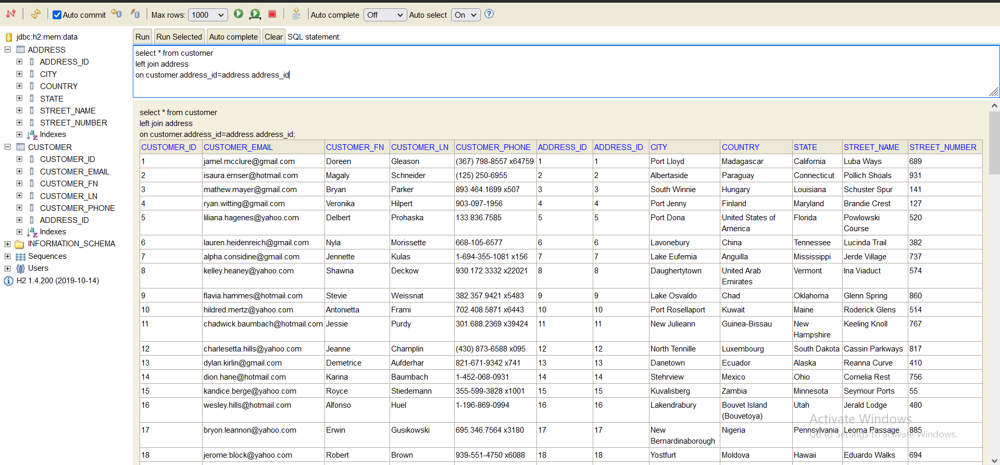

# sample-data-generation-with-faker

a demo app using dependency from:
https://github.com/DiUS/java-faker.git and following a video tut from Dan Vega
to play and test with some data generated for a project...
using Spring Initializer Java 11 and maven!

It's a great way to play around with some data...
